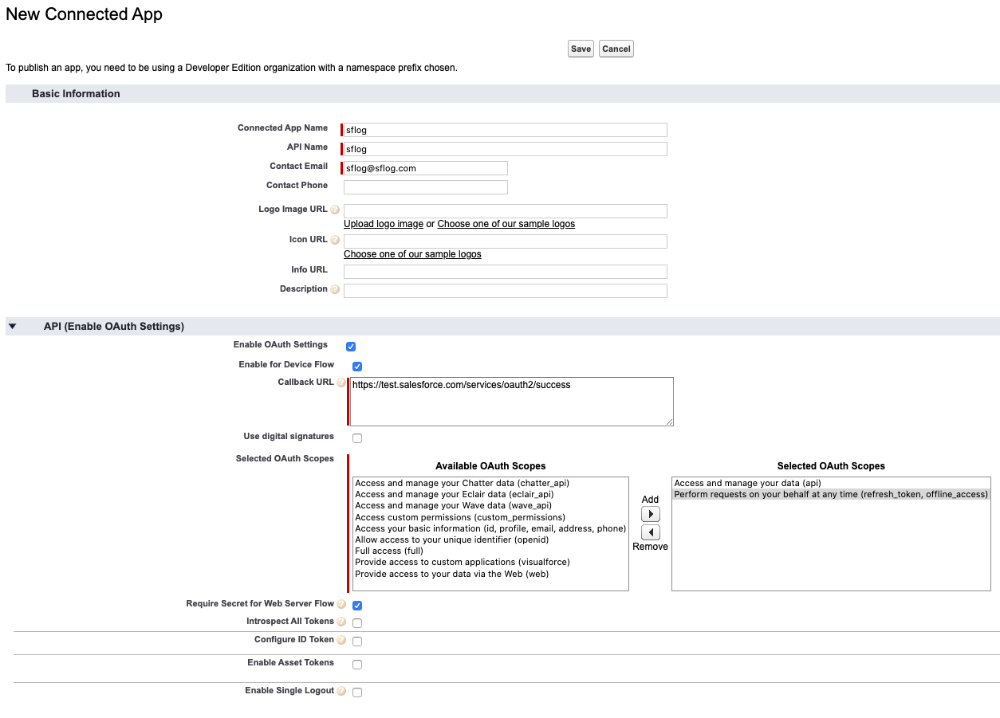

# sflog

sflog is a CLI tool for managing and retrieving salesforce logs.

:warning: Due to Salesforce tooling api limitations sflog must use one API call per log body request.  For example, if there are 50 ApexLog records, sflog will use ~50 API calls.  Be careful when using this tool in a Production org with API limits.

## Installation

Run the `build.sh` script to create the executable binary.  Requires [openjdk8](https://openjdk.java.net/install/) and [maven](https://maven.apache.org/install.html) to build.  Requires [openjre8](https://openjdk.java.net/install/) to run.

## Configuration

Configure the app by running the following command.

```bash
sflog configure
```

Create a connected app in your Salesforce org.  Save the Consumer Key (client_id) and Consumer Secret (client_secret) for the next steps.



## Getting Started

Add a new org :
```bash
sflog org add
```

Select an org to use:
```bash
sflog org use --name $ORG_NAME
```

First use of an org will initiate the OAuth2 device flow to connect to your salesforce instance.  You are required to create a connected app in each salesforce org you wish to manage logs.  This flow will not need to be run again unless the Connected App has to be recreated.

If you need to rerun the OAuth2 device flow use the following command:

```bash
sflog org connect
```

## Usage

- `sflog org [add, remove, use, connect]`
- `sflog logs [get]`
- `sflog trace-flag [set, delete]`

## Future Enhancements

- Tailing logs in real-time
- Trace flag set enhancements
- OAuth 2.0 web flow that doesn't require entering a device code
- Reduction of API calls per action

## Contributing
Pull requests are welcome. For major changes, please open an issue first to discuss what you would like to change.

## Extra Info
This project is not meant to replace the sfdx cli tool log functionality.

## License
[MIT](https://choosealicense.com/licenses/mit/)